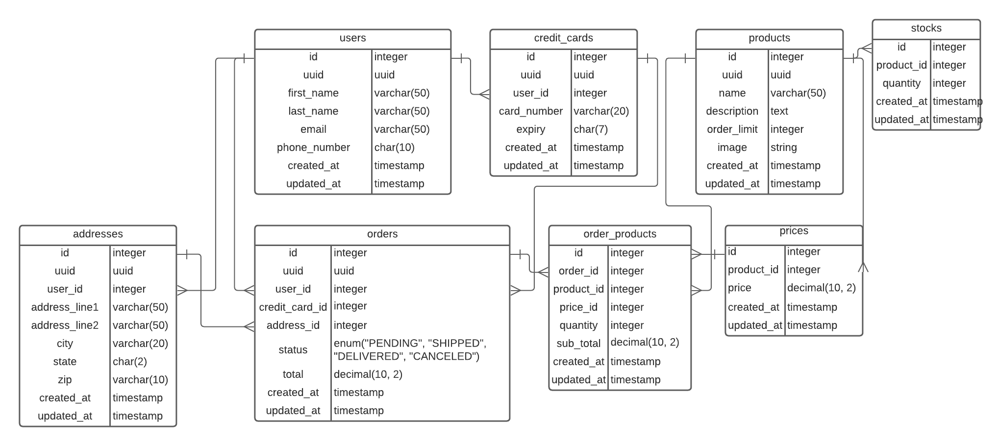

# Curology Shop

## Setup Requirements

* Docker
* Docker Compose
* Make sure that no processes are running on ports: 8080, 3000, and 3001

## Tools and Technologies used

* Ruby on Rails - Backend
* React - Frontend
* DB - Postgres
* Nginx - Web server (proxy)

## Instructions to Run

* Run the below command

```bash
  docker-compose up --build
```

* The command will spin up four docker containers

  * **web** - Nginx container
  * **frontend** - NodeJs container for the React frontend App
  * **backend** - Ruby container for the backend application
  * **db** - Postgres container

* Once all the container are ready to serve, you can access the application at [http://localhost:8080](http://localhost:8080)
* Access the backend application with: [http://localhost:8080/api/magic](http://localhost:8080)

## Project Structure

* backend - Backend Ruby on Rails application
  
  * app - MVC source code
    * channels
    * controllers
      * api
        * magic_controller.rb - Controller for `/api/magic` endpoint
        * products_controller.rb - Controller for the frontend to fetch products
      * concerns - Common code for the controllers
    * jobs
    * mailers
    * models - All the ORM models
      * concerns - Common code for all the models
        * uuid_generator.rb - Generates an Uuid for the included models
      * address.rb - Object mapping for addresses table
      * application_record.rb - Rails provided common model class
      * credit_card.rb - credit_cards table
      * order_product.rb - order_products table
      * order.rb - orders table
      * price - prices table
      * product.rb - products table
      * stock.rb - stocks table
      * user.rb - users table
    * uploaders
      * product_image_uploader.rb - Module to store product images
    * views
  * config - Application/DB/Other Configurations
  * db - Migrations to create the require DB tables
  * lib
  * spec - Tests
  * storage
  * tmp
  * vendor
  * entrypoint.sh - This has commands to Install the required dependent libraries, create the DB tables, run tests, and initializes the basic data(Creates Magic Potion product).
  * Gemfile - Rails dependency management
* data - Volume mount for the db container
* docs - Documents
* frontend
  * src
    * components - Custom components
      * Home.tsx - Home component
      * ProductsList.tsx - To display list of products in the home page
      * ProductDetails.tsx - To display a single product details
      * Checkout.tsx - The checkout page component
      * OrderForm.tsx - Component for the checkout page form
    * actions - Common functions
      * backend.tsx - Functions to interact with backend
    * data
      * states.tsx - US state details
    * types - Custom types
* nginx
  * nginx.config - Nginx config file to setup proxy for the frontend and backend applications
* docker-compose.yml
* Dockerfile-backend - Docker file for the backend
* Dockerfile-frontend - Docker file for the frontend

## Database Design



### Common columns:

* uuid (indexed) - A unique hash for real world entities to refer by other applications
* id - Auto incrementing integer Id for internal mapping
* created_at - Tracks when a record is created
* updated_at - Tracks when a record is last updated

### Tables

* users
  * first_name - String of length 50
  * last_name - String of length 50
  * email_id (indexed) - Identifies a user uniquely by email_id
  * phone - String of length 10

* orders
  * user_id - Foreign key to users table
  * credit_card_id - Foreign key to credit_cards table
  * address_id - Foreign key to addresses table
  * status - Enum values includes: 'pending', 'fulfilled', 'delivered', 'canceled'
  * total - Order total = All order_products qunatity * products.prices.price

* credit_cards - Creates a new credit if doesn't exists during the order request.
  * user_id - Foreign key to users table
  * card_number (indexed)- String of length 20
  * expiry - Stores expiry in the format MM/YYYY

* addresses - Creates a new address if a doesn't exist by address_line1 for the user
  * address_line1 (indexed) - String of length 50
  * address_line2 - String of length 50
  * city - String of length 20
  * state - String of length 2 that stores abbrevations
  * zip - String of length 10(Support for county codes)

* products - For now, it will be just **Magic Potion**
  * name - String of length 50
  * order_limit - cap on order limits
  * description - text
  * image - Image

* prices - Supports multiple price entries per produc, but uniquely referenced in order_products table
  * product_id - Foreign key to products table
  * price - Decimal value (10, 2)

* stocks - Future support
  * product_id - Foreign key to products table
  * quantity - Available quantity

* order_products - Mapping of order and products. It supports multiple orders(Max 3) per user
  * order_id (indexed) - Foriegn key to orders table
  * product_id (indexed)- Foreign key to products table
  * price_id - Foreign key to prices table
  * quantity - Ordered qunatity
  * sub_total - Order sub total = quantity * price

### Design Details

* On every create requests (API and UI), the application creates a new user if doesn't exist prior
* Same with credit card and addresses. The logic look creates new records only if they doesn't exist for the user
* This supports multiple orders from a user, capped by the order limit(3)
* entries in the order_products table manage multiple orders for a user
* I have created indexes whever required

## Frontend Design

* Even though a single page was requested, I have created multiple pages for a better user experience, and for the feature scalability
* This design is useful if we need a checkout flow experience
* It also supports multiple products in the store
* I have used typescript and the following additional libraries:
  * axios
  * react-router-dom
  * formik
  * bootstrap
  * yup

## Backend Design

### APIs

* POST /api/magic - Creates order
* PATCH /api/magic - Updates the order (Only fulfilled)
* DELETE /api/magic/:uid - Deletes an order
* GET /api/magic/:uid - Return an order details
* GET /api/products - Returns all the products in the store

### Storage

* Currently storing the images in the docker container

## Web Server

* Acts as a loadbalancer and proxy
* Forwards all the `/` requests to frontend app running on frontend:3000
* Forwards all the `/api` requests to frontend app running on backend:3000

## Question & Answers

* **Describe your data schema and how it relates to the purchasing of magic potions.**
  * Answered in the above design details
* **Describe how this could scale over time.**
  * Functionality:
    * My solution supports multiple products
    * Multiple orders per user
    * Can easily integerate the user management
    * Can esily build the cart/checkout flow
  * Code:
    * React and typescript on the frontend help easy addition of new components
    * Rails is known for Time To Market, we can build and deploy new endpoints quickly and optimally
  * Infrastructure:
    * Containers are scalable friendly, it's just a matter of spinning new containers or setup an autoscalability to scale as per the need
    * Many application servers that host Rails application can manage concurrent request pretty well, so scaling horizontally cannot be an issue
  * Database:
    * The current design can handle good enough order requests optimially, and can accomodate new indexes for the slow queries
    * Relation database though cannot be scaled horizontally, but they are good enough to handle huge transactions, and data
    * Plus, relational tables support transactions that can used to prevent currupt data
* **Describe your front end architecture and why you chose to create it as you did. Include details about form validation, error handling etc.**
  * I chose react because, it's component based, it supports routing, navigation, and state management pretty well compared to other frameworks
  * Typescript helps to keep code DRY, and it helps to identify the issues statically, rather than dealing with issues during the runtime. It saves the developement/maintenance time
  * I have used `Formik` and `Yup` for form validations, and error handling. These are good libraries that provides most of the common required features, and reduces the boilerplate code
* **Describe the API architecture**
  * Discussed earlier
* **With more time or in a different environment, what would you do differently?**
  * With more time, I would have made my test suite stronger, both in the frontend and the backend applications
  * With a better test suite, we can deploy new features with more confidence, and less issues
  * I could have used some of the cloud services like S3 for image storage, a proper logging tool, a monitoring tool integration.
  * I could have made it more secured by building some OAuth flow, for both UI and the APIs
  * I could have made communications secured over https
  * I could have done a performance test of my application, which gives us an idea about the scalability needs
* **What would you do to improve or scale the application?**
  * Most of it is covered in the previous notes
  * The scalability requirements are based on the application growth
  * We need a proper set of tools in-place to understand the application performance - CPU utilization, Memomory consumption, how it grows with the throughput
  * A proper logging to troubleshoot the issues
  * If database is the bottleneck we need to explore other databases like Cassandra, MongoDB, etc. those are good with the horizontal scaling.
  * We need to track the DB connections, no of reads/writes, DB CPU utilization, I/O read and writes. All these information helps us to be prepared to grow when the need arise
